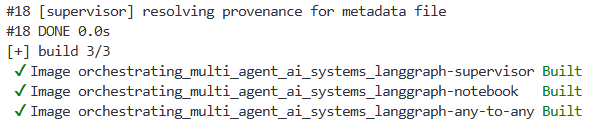
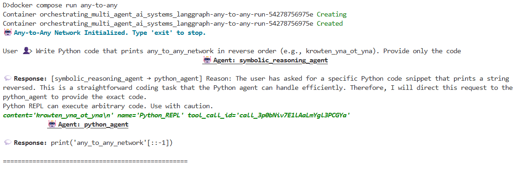

# Multi-Agent Orchestration Systems with LangGraph

This repository demonstrates three common multi-agent architectures in LangGraph:

* **Any-to-Any Multi-Agent Networks**: Agents communicate directly with one another without a central coordinator.

<p align="center">
  
</p>

* **Supervisor Multi-Agents**: A supervisor agent coordinates specialized worker agents and manages task routing.
<p align="center">
  
</p>

* **Supervisor Tool-Calling Multi-Agents**: A supervisor agent can both delegate tasks to agents and directly invoke tools.

<p align="center">
  
</p>


The project provides a side-by-side comparison of these architectures and includes both educational examples and production-oriented implementations.

## Prerequisites

Before running the examples, install:

* Docker Desktop (recommended)
* Git

Verify your installation:

```bash
docker --version
docker compose version
git --version
```

## Clone the Repository

```bash
git clone https://github.com/MehdiRezvandehy/multi_agent_orchestration_systems_with_langGraph.git

cd multi_agent_orchestration_systems_with_langGraph
```

## Environment Setup

Create a `.env` file in the root directory and add the required API keys:

```bash
OPENAI_API_KEY=your_openai_api_key_here
SERP_API_KEY=your_serpapi_key_here
```

* `OPENAI_API_KEY` → required for OpenAI-based LLM / GenAI functionality
* `SERP_API_KEY` → required for Google Search (SerpAPI) tool integration

These environment variables are loaded automatically in the code:

```python
os.environ["OPENAI_API_KEY"] = os.environ.get("OPENAI_API_KEY")
os.environ["SERP_API_KEY"] = os.environ.get("SERP_API_KEY")
```

Make sure the `.env` file is present before running either the notebook or Python implementations (locally or via Docker Compose).


## Overview

The accompanying notebook (`multi_agent_architectures_langGraph.ipynb`) demonstrates each architecture using a simple example with three agents to help visualize agent communication and orchestration patterns.

In addition to the notebook, the repository includes modular Python implementations with separate:

* **Agents** (`agents.py`)
* **Tools** (`tools.py`)
* **Architecture configurations** (`any_to_any_network.py`, `supervisor_network.py`, `supervisor_tool_calling.py`)

Docker Compose is the recommended approach because it:

* Ensures consistent environments across machines
* Eliminates dependency conflicts
* Simplifies setup and onboarding
* Makes experiments reproducible
* Mirrors production deployment workflows

### Build Docker Images

```bash
docker compose build
```


### Run Any-to-Any Architecture

```bash
docker compose run any-to-any
```


### Run Supervisor Architecture

```bash
docker compose run supervisor
```

### Run Supervisor Tool-Calling Architecture

```bash
docker compose run supervisor-tool-calling
```

## Running the Notebook in Docker

Start Jupyter Notebook:

```bash
docker compose up notebook
```

Then open the Jupyter URL displayed in the terminal or Docker logs.

The notebook provides a simplified demonstration of all three architectures using three agents.

## Running Without Docker

You can also run the notebook and Python implementations in a Python virtual environment.

Create and activate a virtual environment:

```bash
python -m venv .venv

# Linux / macOS
source .venv/bin/activate

# Windows
.venv\Scripts\activate
```

Install dependencies:

```bash
pip install -r requirements.txt
```

Run Jupyter Notebook:

```bash
jupyter notebook
```

## Running the Python Implementations

Example:

```bash
python any_to_any_network.py
```

```bash
python supervisor_multi_agent.py
```

```bash
python supervisor_tool_calling.py
```

These implementations are organized for extension and production use, allowing you to add your own agents, tools, and workflows.

## References

For a detailed discussion of the architectures, design trade-offs, and implementation details, visit my portfolio website.

## License

MIT License
